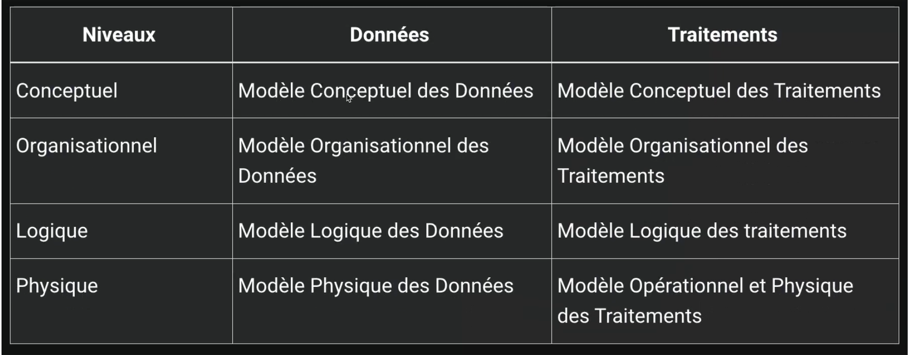

 - git init.

- git status

- git add .

- git commit -m "ton commit"

# Plans de données :
- Systeme pilotage, Systeme D'info et Systeme opérant.

- Une valeur prise par une info elementaire est une occurence.

# Approche nivelée (Niveau)

Shematisé le plans : 
- niveau conceptuel
- niveau organisationnel 
- niveau logique
- niveau physique

# Collecte d'info 

## Niveau Logique : 
- modele logiuqe données (MLD) 
- modele logique traitement (MLT)
- Systeme Gestion BDD (SGBD)

## Niveau Physique : 
- Modele physique donnée (MPD)

# Les dependances de Merise : 

- Chaine de caratères, forma texte
- type alphanumérique, forma texte
- Type numérique (integer, float...)
- Type date (date, datetime, timestamp)
- Logique du booleen (true, false)

tout cela est stocké dans le dictionnaire de données 

Le dictionnaire de donnée permet de recenser l'ensemble des données, données systeme.

## Les dépendances fonctionnielles 

Le role d'une dep fonctionnelles est de faire la relations entre deux attributs d'une table

## Les dépendances fonctionnielles composees 
 Fait intervenir plus de deux attributs

 ## Les dépendances fonctionnielles elementaires
 une dependance fonctionnelle A -> B est elementaire si une donnee C, sous ensemble de A qui decrit une dependance fonctionnelle type C -> B 

 Exemples : 
 - RefProduit -> Libelle Produit
 - NumCommande RefProduit -> QuantiteCommandee
 - ~~NumCommande RefProduit -> DesignationProduit~~ 

 
