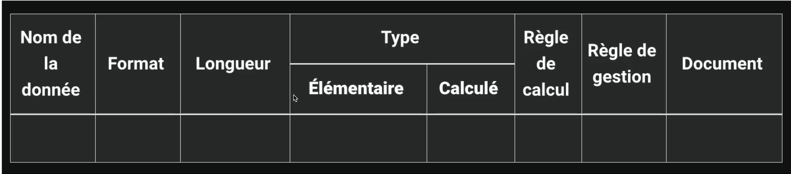
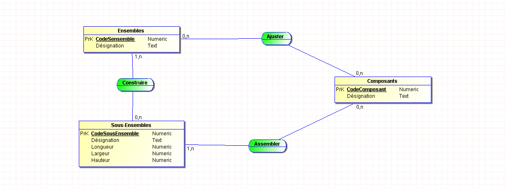

 - git init.

- git status

- git add .

- git commit -m "ton commit"

# Plans de données :
- Systeme pilotage, Systeme D'info et Systeme opérant.

- Une valeur prise par une info elementaire est une occurence.

# Approche nivelée (Niveau)

Shematisé le plans : 
- niveau conceptuel
- niveau organisationnel 
- niveau logique
- niveau physique

# Collecte d'info 

## Niveau Logique : 
- modele logiuqe données (MLD) 
- modele logique traitement (MLT)
- Systeme Gestion BDD (SGBD)

## Niveau Physique : 
- Modele physique donnée (MPD)

# Les dependances de Merise : 

- Chaine de caratères, forma texte
- type alphanumérique, forma texte
- Type numérique (integer, float...)
- Type date (date, datetime, timestamp)
- Logique du booleen (true, false)

tout cela est stocké dans le dictionnaire de données 

Le dictionnaire de donnée permet de recenser l'ensemble des données, données systeme.

## Les dépendances fonctionnielles 

Le role d'une dep fonctionnelles est de faire la relations entre deux attributs d'une table

## Les dépendances fonctionnielles composees 
 Fait intervenir plus de deux attributs

 ## Les dépendances fonctionnielles elementaires
 une dependance fonctionnelle A -> B est elementaire si une donnee C, sous ensemble de A qui decrit une dependance fonctionnelle type C -> B 

 Exemples : 
 - RefProduit -> Libelle Produit
 - NumCommande RefProduit -> QuantiteCommandee
 - ~~NumCommande RefProduit -> DesignationProduit~~ 

# Partie conceputelle MCD :
 
MCD est un schéma conceptuel qui permet de représenter les donées d'une entreprise
Propriétés
Entités
Relations
 
Les propriétés sont les informations de base d'un système d'information. Elles disposent d'un type et d'une longueur. Nous n'allons pas décrire en détail les propriétés. Nous allons simplement les nommer.
 
Les entittés ou objets :
Les entittés sont un ensemble de propriétés qui décrivent un objet du système d'information. Elles sont représentées par un rectangle.
 
L'identifiant :
L'une de ces propriétés est l'identifiant. L'indetifiant est une propriété qui permet d'identifier de manière unique une entité. Il est représenté par un souligné.

# Les relations ou Associations

Les relations permetten de relier les entités entres elle. Par exemple : 
- un client peut passer une ou plusieur commandes: 

# Les cardinalités 
Une cardinalité exprime le nombre de fois ou l'occurence d'une entite participe aux occurences de la relation
 - Combien de fois au minimum un client peut-il commander un article ? 
 - Combien de fois au maximum un client peut-il commander un article ? 
 

 Pour obtenir la cardinalité suivante on se pose les memes questions, mais cette fois-ci pour l'entitié Article.
 - Combien de fois au minimum un Article peut etre commander ?
 - Combien de fois au maximum un Article peut etre commander ?

Les cardinalités : 

- Une mere peut elever un ou plusieurs enfants
- Un enfant peut etre eleve par une et une seule mere 

# Relation Porteuse (Propriété) : 
Une relation porteuse est dite si elle possede des propiretes.

Relation qui fait intervenir deux entites : c'est une relation binaire
Relation qui fait intervenir trois entites : c'est une relation ternaire.

# Les relations Reflexives :
Une relation est dite reflexive si elle relie une entite a elle meme.

### Regle de conception
 # Les relations reflexives :
 
Une relation est dite reflexive si elle relie une entite a elle meme
(photo reflexive)
 
 
# Règles d'usage :
 
Toute entité doit forcément avoir un identifiant
Toutes les propriétés de l'entité dépendent fonctionnelement de l'idenfifiant
Le nom d'une propiété doit apparaitre une seule fois dans un modèle de propriété (tout le MCD)
On peut utiliser un préfixe ou suffixe
 
 
# Notion d'entite forte et d'entite faible
 
Forte : peut exister seule (pas besoin d'autres entités)
Faible : a besoin d'une autre entite pour exister
 
 
# Contraintes d'integrite fonctionnelle (CIF)
 
Une CIF est definie par le fait qu'une des entites de l'assocation est completement determinee par la connaissance d'une ou plusieuurs entites participant à l'association
(photo contrainte integrite)

Voici je qu'on a fait ce jour : 

Voici le MCD effectuer sans les cardinalités
    

# Mardi : 

### Le MLD : 

Pour representer une relation, on va remplacer la relation par une clé etrangère.

Dans le cas ou la "cardinalité max" est n des deux cotés, on cree une entité intermediaire qui va contenir les deux clés etrangeres des deux entites.

Lorsque l'on passe du MCD au MLD c'est la cardinalité qui a maximale = 1 recevra l'identifiant ou les identifiants ayant les cardinalités maximales les plus fortes

Les relations ayant toutes leurs entités reliés avec des caridnalites maximales superieures a 1 se transfomreront en entite en absorbant les identifiants des entités jointes.

# MPD : 

Le MPD permet de passer du modele logique au modele physique des donnees.

1er etape : créer un shéma relationnel (ecrire ce que l'on voit)
2e etape : verifier que tout est bon 

Convention de nommage de SGBD

Exo 1 : 

Voici le mld de l'exercice : 

Ventes (  #Num ventes,   Quantité,   Date de vente,   Num Produit,   Num Produits_Produits  )

Prix de vente (  #Nom de produits,   Num ventes_Ventes  )

Produits (  #Num Produits,   Type Produit,   Poids Produit  )

Exo 2 : 
